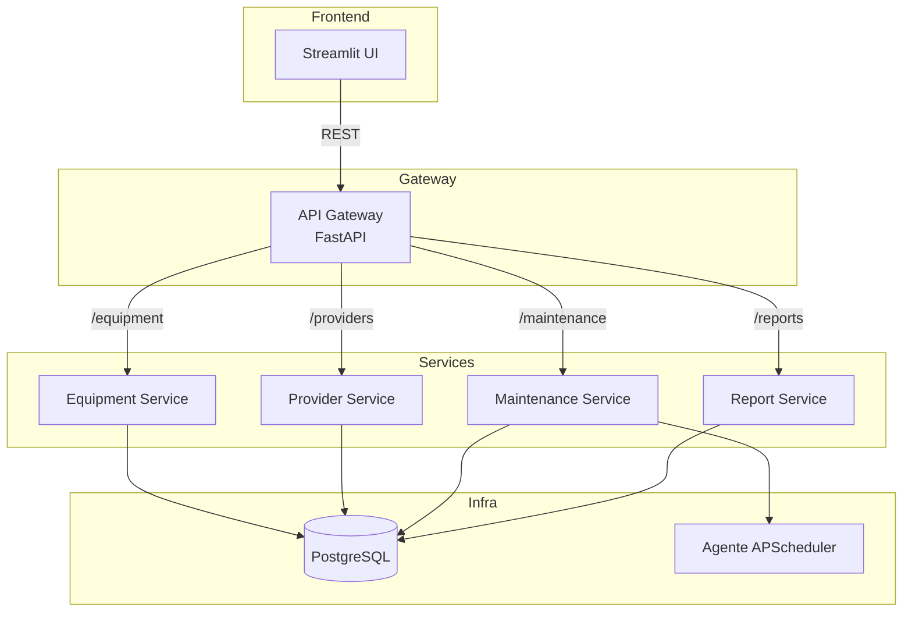
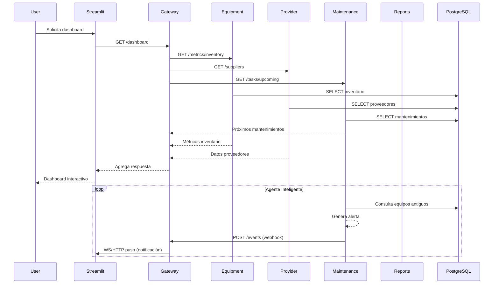
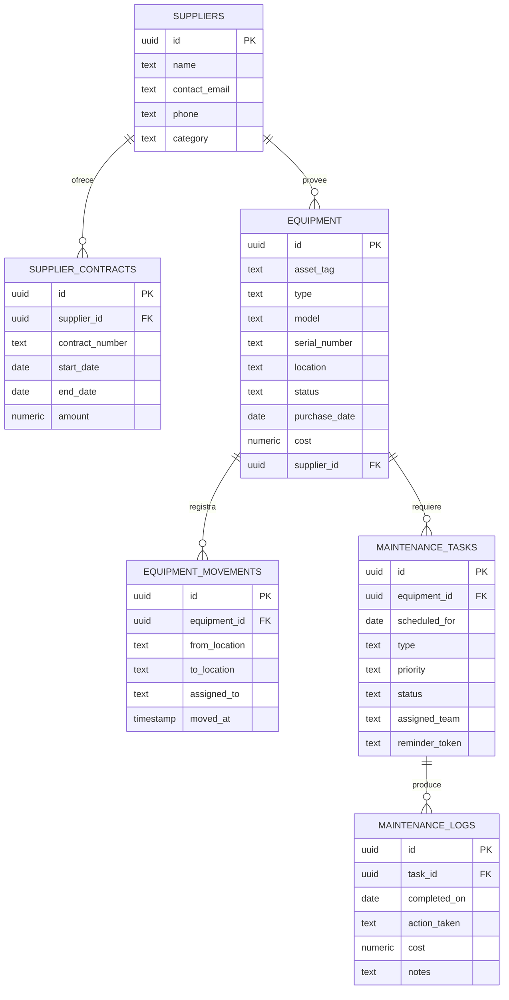

## Diagramas de la Solución

### Arquitectura de Microservicios

```mermaid
graph TD
    subgraph Frontend
        ST[Streamlit UI]
    end
    subgraph Gateway
        GW[API Gateway\nFastAPI]
    end
    subgraph Services
        EQ[Equipment Service]
        PR[Provider Service]
        MT[Maintenance Service]
        RP[Report Service]
    end
    subgraph Infra
        DB[(PostgreSQL)]
        SCHED[Agente APScheduler]
    end

    ST -->|REST| GW
    GW -->|/equipment| EQ
    GW -->|/providers| PR
    GW -->|/maintenance| MT
    GW -->|/reports| RP
    EQ --> DB
    PR --> DB
    MT --> DB
    RP --> DB
    MT --> SCHED
```

### Flujo de Datos e Iteraciones

```mermaid
sequenceDiagram
    participant User
    participant Streamlit
    participant Gateway
    participant Equipment
    participant Provider
    participant Maintenance
    participant Reports
    participant PostgreSQL

    User->>Streamlit: Solicita dashboard
    Streamlit->>Gateway: GET /dashboard
    Gateway->>Equipment: GET /metrics/inventory
    Gateway->>Provider: GET /suppliers
    Gateway->>Maintenance: GET /tasks/upcoming
    Equipment->>PostgreSQL: SELECT inventario
    Provider->>PostgreSQL: SELECT proveedores
    Maintenance->>PostgreSQL: SELECT mantenimientos
    Maintenance-->>Gateway: Próximos mantenimientos
    Equipment-->>Gateway: Métricas inventario
    Provider-->>Gateway: Datos proveedores
    Gateway-->>Streamlit: Agrega respuesta
    Streamlit-->>User: Dashboard interactivo

    loop Agente Inteligente
        Maintenance->>PostgreSQL: Consulta equipos antiguos
        Maintenance-->>Maintenance: Genera alerta
        Maintenance->>Gateway: POST /events (webhook)
        Gateway->>Streamlit: WS/HTTP push (notificación)
    end
```

### Modelo de Datos (Entidad-Relación)

```mermaid
erDiagram
    SUPPLIERS ||--o{ SUPPLIER_CONTRACTS : ofrece
    SUPPLIERS ||--o{ EQUIPMENT : provee
    EQUIPMENT ||--o{ EQUIPMENT_MOVEMENTS : registra
    EQUIPMENT ||--o{ MAINTENANCE_TASKS : requiere
    MAINTENANCE_TASKS ||--o{ MAINTENANCE_LOGS : produce

    SUPPLIERS {
        uuid id PK
        text name
        text contact_email
        text phone
        text category
    }
    SUPPLIER_CONTRACTS {
        uuid id PK
        uuid supplier_id FK
        text contract_number
        date start_date
        date end_date
        numeric amount
    }
    EQUIPMENT {
        uuid id PK
        text asset_tag
        text type
        text model
        text serial_number
        text location
        text status
        date purchase_date
        numeric cost
        uuid supplier_id FK
    }
    EQUIPMENT_MOVEMENTS {
        uuid id PK
        uuid equipment_id FK
        text from_location
        text to_location
        text assigned_to
        timestamp moved_at
    }
    MAINTENANCE_TASKS {
        uuid id PK
        uuid equipment_id FK
        date scheduled_for
        text type
        text priority
        text status
        text assigned_team
        text reminder_token
    }
    MAINTENANCE_LOGS {
        uuid id PK
        uuid task_id FK
        date completed_on
        text action_taken
        numeric cost
        text notes
    }
```

